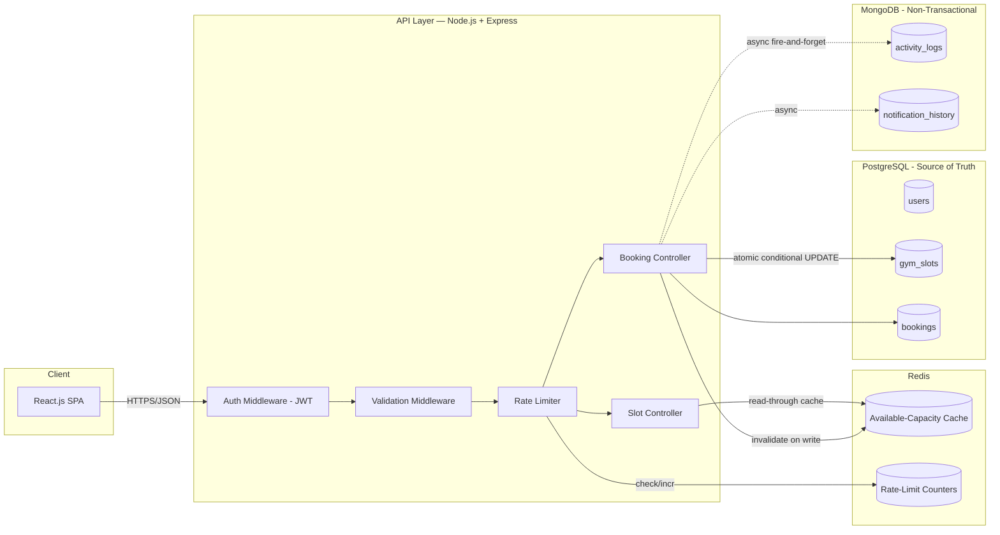

# 🏋️ Gym Slot Booking — System Design Document

**Phase:** Day 1 — Design Only (no implementation code)
**Stack:** React.js · Node.js/Express · PostgreSQL · MongoDB · Redis (MERN + SQL)

---

## 1. Problem Understanding & Assumptions

**Problem, in my own words:** Users book one-hour gym slots that each have a fixed capacity (10). The system must never let more bookings succeed than the capacity allows, even when many users hit "Book" on the same slot at the exact same instant. Users can also cancel to free up a spot for someone else.

**Core features in scope (deliberately no more):**
1. View slots with remaining capacity
2. Book a slot (rejected once full)
3. Cancel a booking (capacity is released)

**Assumptions made explicit (since the brief doesn't state them):**

| # | Assumption | Reasoning |
|---|---|---|
| A1 | A slot is a fixed, pre-defined time window (e.g. 6–7 AM) tied to a specific date, not a recurring abstract concept. | Capacity is checked "today at 6 AM", so slots must be date-bound instances, not just a time-of-day template. |
| A2 | A user can hold **only one active booking per slot** (can't double-book the same slot). | Prevents one user from hoarding spots; standard booking-system norm. |
| A3 | A user **can** book multiple *different* slots on the same day. | Not restricted by the problem statement. |
| A4 | Cancellation is allowed any time before the slot's start time; no partial-refund/penalty logic since none was asked for. | Keeps scope to what's stated. |
| A5 | Authentication is required to book/cancel; viewing slots can be public. | Standard for a booking system; also required by the mandatory JWT rule. |
| A6 | No waitlist, no admin panel, no payments — explicitly excluded to respect "no additional features." | Matches the instruction to design only the stated problem. |
| A7 | Capacity is fixed at 10 per slot for this version (per the constraint given); not user-configurable in this iteration. | Stated constraint. |

---

## 2. High-Level Design (HLD)



**Flow of a booking request:**
`Client → Express → JWT auth → input validation → rate limiter (Redis) → Booking Controller → single atomic SQL statement against PostgreSQL (source of truth) → on success: invalidate Redis cache key + async-write an audit event to MongoDB → response to client.`

---

## 3. Database Schema

### 3.1 Why PostgreSQL vs MongoDB

| Data | Store | Why |
|---|---|---|
| Users, gym slots, bookings | **PostgreSQL** | Strong relational integrity, ACID transactions, and row-level locking are required — this is exactly the data where "capacity must never go negative" has to be mathematically guaranteed. |
| Activity/audit logs, notification history | **MongoDB** | High write volume, no relational integrity needed, flexible/append-only schema, never blocks the booking-critical path. |

### 3.2 PostgreSQL Schema

```sql
CREATE TABLE users (
    id              UUID PRIMARY KEY DEFAULT gen_random_uuid(),
    name            VARCHAR(100)  NOT NULL,
    email           VARCHAR(255)  NOT NULL UNIQUE,
    password_hash   VARCHAR(255)  NOT NULL,
    role            VARCHAR(20)   NOT NULL DEFAULT 'member',  -- member | admin
    created_at      TIMESTAMPTZ   NOT NULL DEFAULT now()
);

CREATE TABLE gym_slots (
    id              UUID PRIMARY KEY DEFAULT gen_random_uuid(),
    slot_date       DATE          NOT NULL,
    start_time      TIME          NOT NULL,
    end_time        TIME          NOT NULL,
    capacity        SMALLINT      NOT NULL DEFAULT 10,
    booked_count    SMALLINT      NOT NULL DEFAULT 0,
    created_at      TIMESTAMPTZ   NOT NULL DEFAULT now(),
    CONSTRAINT chk_capacity_bounds CHECK (booked_count >= 0 AND booked_count <= capacity),
    CONSTRAINT uq_slot_window UNIQUE (slot_date, start_time, end_time)
);

CREATE TABLE bookings (
    id              UUID PRIMARY KEY DEFAULT gen_random_uuid(),
    user_id         UUID NOT NULL REFERENCES users(id),
    slot_id         UUID NOT NULL REFERENCES gym_slots(id),
    status          VARCHAR(20) NOT NULL DEFAULT 'confirmed',  -- confirmed | cancelled
    booked_at       TIMESTAMPTZ NOT NULL DEFAULT now(),
    cancelled_at    TIMESTAMPTZ
);

-- One ACTIVE booking per user per slot (partial unique index)
CREATE UNIQUE INDEX uq_active_booking_per_user_slot
    ON bookings (user_id, slot_id)
    WHERE status = 'confirmed';

-- Read/query performance
CREATE INDEX idx_slots_date            ON gym_slots (slot_date);
CREATE INDEX idx_bookings_user_status  ON bookings (user_id, status);
CREATE INDEX idx_bookings_slot_status  ON bookings (slot_id, status);
```

**Key design choices:**
- `booked_count` is a **denormalized counter on `gym_slots`**, kept correct by a single atomic `UPDATE` (see §5) instead of computing `COUNT(*)` on every request — that avoids an expensive aggregate query on the hot read path.
- The `CHECK` constraint is a **database-enforced safety net**: even if application logic had a bug, Postgres itself will physically refuse to let `booked_count` exceed `capacity` or go negative.
- The partial unique index stops a user from booking the same slot twice, without needing an application-level check-then-insert (which would itself be a race condition).

### 3.3 MongoDB Collections

```jsonc
// activity_logs
{
  "_id": ObjectId,
  "eventType": "SLOT_BOOKED" | "SLOT_CANCELLED" | "BOOKING_REJECTED_FULL" | "LOGIN",
  "userId": "uuid-from-postgres",
  "slotId": "uuid-from-postgres",
  "metadata": { "ip": "...", "userAgent": "..." },
  "timestamp": ISODate
}

// notification_history
{
  "_id": ObjectId,
  "userId": "uuid-from-postgres",
  "channel": "email" | "push",
  "message": "Your 6 AM slot is confirmed",
  "sentAt": ISODate,
  "status": "sent" | "failed"
}
```

These writes are **fire-and-forget / async** and never sit in the critical path of a booking transaction — Mongo being briefly unavailable must never block or fail a booking.

---

## 4. API Contract

| Method | Endpoint | Auth | Request Body | Success | Error Cases |
|---|---|---|---|---|---|
| POST | `/api/auth/register` | ❌ | `{name, email, password}` | `201 {id, name, email}` | `400` validation, `409` email exists |
| POST | `/api/auth/login` | ❌ | `{email, password}` | `200 {token, expiresIn}` | `401` invalid credentials |
| GET | `/api/slots?date=YYYY-MM-DD` | ❌ | — | `200 [{id, startTime, endTime, capacity, available}]` | `400` bad date |
| GET | `/api/slots/:id` | ❌ | — | `200 {id, startTime, endTime, capacity, available}` | `404` not found |
| POST | `/api/bookings` | ✅ | `{slotId}` | `201 {bookingId, slotId, status}` | `400` invalid, `401` no auth, `404` slot not found, `409` slot full, `409` already booked |
| DELETE | `/api/bookings/:id` | ✅ | — | `200 {bookingId, status:"cancelled"}` | `401`, `403` not owner, `404` not found, `409` already cancelled |
| GET | `/api/bookings/me` | ✅ | — | `200 [{bookingId, slot, status}]` (paginated) | `401` |

**Standard error shape (never a raw stack trace):**
```json
{
  "error": {
    "code": "SLOT_FULL",
    "message": "This slot has no remaining capacity."
  }
}
```

All list endpoints (`/api/slots`, `/api/bookings/me`) support `?page=&limit=` to avoid unbounded queries.

---

## 5. Solving the Concurrency Problem (the core of this assignment)

**Scenario:** 1 spot left, 3 requests arrive within the same second → exactly 1 must succeed, capacity must never go negative or exceed 10.

### Chosen approach: single atomic conditional `UPDATE`, guarded by the database

```sql
BEGIN;

UPDATE gym_slots
SET booked_count = booked_count + 1
WHERE id = $1
  AND booked_count < capacity
RETURNING booked_count;

-- If 0 rows were returned/affected → slot was already full → rollback and return 409 SLOT_FULL
-- If 1 row affected → this request "won" the last spot → proceed to insert the booking row

INSERT INTO bookings (user_id, slot_id, status)
VALUES ($2, $1, 'confirmed');

COMMIT;
```

**Why this beats a naive "read count, then insert if < capacity" approach:** reading and writing as two separate steps is a classic TOCTOU (time-of-check-to-time-of-use) race — three concurrent requests could all read `9/10`, all decide "there's room," and all insert, blowing past capacity. The `UPDATE ... WHERE booked_count < capacity` is a **single atomic statement**: PostgreSQL guarantees that concurrent writers to the same row are serialized at the row level, so only as many `UPDATE`s as there are remaining spots can ever succeed — the rest simply affect 0 rows and are rejected deterministically. No explicit `SELECT ... FOR UPDATE` lock is even needed because the conditional `UPDATE` *is* the atomic check-and-act.

**Why not a Redis distributed lock for this?** Redis is not the source of truth here — Postgres is. A Redis lock (e.g. Redlock) adds a second system that can itself fail, drift, or expire mid-request, and correctness would still ultimately depend on the database. Using the database's own atomicity guarantees is simpler, has one fewer moving part to reason about under failure, and is the textbook-correct tool for "protect a row's numeric invariant." Redis is deliberately reserved for what it's actually good at (§6): caching hot reads and rate-limiting — not for enforcing a hard business invariant.

**Double-booking protection:** the `uq_active_booking_per_user_slot` partial unique index (§3.2) means even if the same user double-clicks "Book," the second `INSERT` fails with a unique-violation, which the API translates to `409 ALREADY_BOOKED`.

**Cancellation (symmetric, also atomic):**
```sql
BEGIN;
UPDATE bookings SET status = 'cancelled', cancelled_at = now()
WHERE id = $1 AND user_id = $2 AND status = 'confirmed';

UPDATE gym_slots SET booked_count = booked_count - 1
WHERE id = $3 AND booked_count > 0;
COMMIT;
```

---

## 6. Redis Usage Plan

| Use | Key pattern | Strategy |
|---|---|---|
| **Cache hot read** — available capacity per slot, since `GET /api/slots` is the most-read endpoint | `slot:{slotId}:available` | Cache-aside: read from Redis first; on miss, read Postgres and populate with a short TTL (e.g. 10s). **Write-invalidate**: on every successful booking/cancellation, delete (or refresh) the key in the same request so the cache never serves stale capacity for long. |
| **Rate-limiting** — protect `POST /api/bookings` from abuse/spam-clicking | `ratelimit:booking:{userId}` | Fixed-window or sliding-window counter (e.g. `INCR` + `EXPIRE`), capping to N booking attempts per minute per user; returns `429 Too Many Requests` past the limit. |

**Redis is explicitly *not* the source of truth for capacity correctness** — see §5. If Redis is down, the API falls back to reading directly from PostgreSQL (fail-open on cache, fail-safe on the DB write path) so booking correctness is unaffected by a cache outage.

---

## 7. Security Approach

- **AuthN:** JWT issued on login, short expiry + refresh strategy; `Authorization: Bearer <token>` required on booking/cancel routes.
- **AuthZ:** a user can only cancel their own booking (`403` otherwise); admin role reserved for future slot-management endpoints (out of scope now).
- **Passwords:** hashed with bcrypt (cost factor ≥ 10), never stored or logged in plain text.
- **Input validation/sanitization:** schema validation (e.g. Joi/Zod) on every request body/query param before it reaches business logic — blocks SQL injection (also mitigated structurally by parameterized queries / an ORM, never string-concatenated SQL) and NoSQL injection into Mongo writes.
- **Secrets:** DB URLs, JWT secret, Redis URL all in environment variables, never hard-coded or committed (`.env` gitignored, `.env.example` committed).
- **Rate-limiting:** applied to `POST /api/bookings` (per §6) and `POST /api/auth/login` (to blunt brute-force attempts).
- **Transport:** HTTPS assumed in front of the API (terminated at load balancer/reverse proxy).

---

## 8. Scalability & Performance

- **Indexing:** covered in §3.2 — every filtered/sorted column (`slot_date`, `user_id`, `slot_id`, `status`) is indexed; no endpoint does a full table scan.
- **Pagination:** enforced on all list endpoints; no unbounded queries.
- **Caching:** the 1–2 hottest reads (slot list, single-slot availability) are cached in Redis with short TTL + active invalidation (§6).
- **Scaling to 100x traffic:**
  - Node/Express API servers are **stateless** (JWT, no server-side session) → horizontally scale behind a load balancer.
  - PostgreSQL: connection pooling (PgBouncer) to handle many app instances; **read replicas** for `GET /api/slots` reads, while writes (bookings) stay on the primary since they need the atomicity guarantee.
  - Redis: can move to a small cluster/replica setup for the cache layer without affecting correctness, since it's not the system of record.
  - MongoDB: scales horizontally by sharding on `userId`/date if audit-log volume grows, with zero impact on the booking-critical path since it's fully decoupled (async writes).

---

## 9. Error Handling

- Every response uses consistent HTTP status codes: `400` validation, `401` unauthenticated, `403` unauthorized, `404` not found, `409` conflict (`SLOT_FULL`, `ALREADY_BOOKED`), `429` rate-limited, `500` unexpected — never a raw stack trace to the client (caught centrally by an Express error-handling middleware).
- **Explicit failure paths:**
  - *PostgreSQL down:* booking/cancel endpoints fail fast with `503 Service Unavailable`; the API never silently "pretends" a booking succeeded.
  - *Redis down:* cache reads fall back to Postgres directly; rate-limiter fails open (or optionally fails closed for the booking endpoint specifically, as a deliberate trade-off — see §10) rather than crashing the request.
  - *MongoDB down:* audit/notification writes are best-effort and swallowed with a logged warning — they never fail or roll back a booking.
  - *Invalid input:* rejected at the validation-middleware layer before touching any database.
  - *Conflict (slot full / already booked):* the atomic `UPDATE` in §5 deterministically produces this outcome — surfaced as `409` with a clear machine-readable `code`.

---

## 10. Known Limitations & Trade-offs

- **No waitlist / notify-when-available feature** — intentionally excluded to keep scope to exactly what was asked (view / book / cancel).
- **No admin UI for creating/editing slots** in this version — slots are assumed pre-seeded; would add an admin CRUD API next.
- **Fixed capacity (10), not per-slot-configurable** in this iteration, matching the stated constraint; the schema already supports arbitrary capacities per slot if that changes.
- **Rate-limiter fail-open vs fail-closed** during a Redis outage is a real trade-off: fail-open keeps the app usable but briefly loses abuse protection; fail-closed protects against abuse but blocks legitimate bookings during a Redis incident. Documented here as a conscious choice to revisit with more time/real traffic data.
- **No idempotency key** on `POST /api/bookings` yet (e.g. for client retry-on-timeout safety) — the unique-active-booking constraint prevents a *duplicate* booking, but a true idempotency-key pattern would be a cleaner long-term fix for network-retry scenarios.
- **With more time:** would add integration tests specifically simulating the 3-concurrent-requests-for-1-spot scenario, and a Docker Compose file for one-command local spin-up of Postgres + Redis + Mongo.
