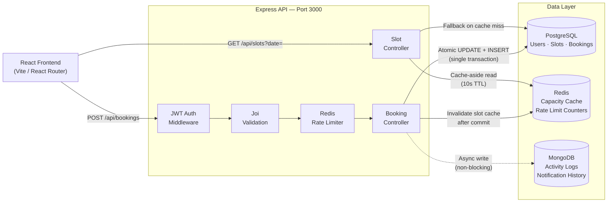

# Gym Slot Booking System — Design Document

**Author:** Milan Raj  
**GitHub:** [milanraj-github/Gym-Slot-Booking](https://github.com/milanraj-github/Gym-Slot-Booking)  
**Stack:** React.js · Node.js / Express · PostgreSQL · MongoDB · Redis  
**Timeline:** 2-day Full-Stack Challenge — Day 1 Design

---

## 1. Problem Understanding

Members can browse gym slots for a given date and book a one-hour window. Each slot holds exactly 10 people. Once those 10 spots are taken, the next booking must be refused immediately — no queueing.

The real challenge here isn't building CRUD around slots. It's what happens when three people click "Book" on the last remaining spot at the same instant. A naive read-then-write approach lets all three through. This document is built entirely around solving that one problem correctly before touching anything else.

### Assumptions

| # | Assumption | Why |
|---|------------|-----|
| A1 | A slot is a specific date + time window (e.g. Aug 27, 6–7 AM), not a recurring label. | The brief talks about a slot "filling up" on a given day — a template alone can't hold a `booked_count`. |
| A2 | One user can hold only one active booking per slot. | Otherwise a single person could consume multiple spots meant for others. |
| A3 | A user may book different slots on the same day. | Nothing in the brief restricts this. Gyms don't usually stop two classes in a day. |
| A4 | Cancellation is allowed any time before the slot starts. No penalty logic. | Keeps scope on the concurrency problem, not billing rules. |
| A5 | Booking and cancelling require login. Browsing slots does not. | Matches the JWT requirement and standard booking-app UX. |
| A6 | No waitlist, no admin dashboard, no payments. | The brief is explicit about not padding scope. |
| A7 | Capacity is fixed at 10 per slot. | That's the stated constraint — the schema doesn't prevent configuring it later. |

---

## 2. High-Level Design

The shape is straightforward: React frontend, Express API, Postgres as the system of record, Redis for reads and rate-limiting, Mongo for async audit logs. The critical point is that **Postgres, not Redis, has the final say on capacity.**



A booking goes through JWT auth → Joi validation → Redis rate limiter → booking controller → Postgres atomic transaction. Redis is only touched for capacity cache reads and rate-limit counters. Mongo receives audit-log writes after the Postgres transaction commits, with no awaiting — if Mongo is slow, bookings are completely unaffected.

---

## 3. Database Schema

### 3.1 Why the split between PostgreSQL and MongoDB

**PostgreSQL** holds users, slots, and bookings. This is where `booked_count` must never go negative or exceed capacity — a constraint that needs real transactions and row-level locking. Rebuilding that guarantee by hand in a document store is not a trade worth making.

**MongoDB** holds activity logs and notification history. These are append-only writes that happen far more often than they're read. A lost or delayed write is a gap in a log, not a correctness problem. It's a natural fit for a schema-flexible, high-write store, and it lets these writes happen completely off the booking request's critical path.

### 3.2 PostgreSQL Tables

```sql
-- Users
CREATE TABLE users (
    id            UUID PRIMARY KEY DEFAULT gen_random_uuid(),
    name          VARCHAR(100)  NOT NULL,
    email         VARCHAR(255)  NOT NULL UNIQUE,
    password_hash VARCHAR(255)  NOT NULL,
    role          VARCHAR(20)   NOT NULL DEFAULT 'member',
    created_at    TIMESTAMPTZ   NOT NULL DEFAULT now()
);

-- Slots
CREATE TABLE gym_slots (
    id           UUID PRIMARY KEY DEFAULT gen_random_uuid(),
    slot_date    DATE      NOT NULL,
    start_time   TIME      NOT NULL,
    end_time     TIME      NOT NULL,
    capacity     SMALLINT  NOT NULL DEFAULT 10,
    booked_count SMALLINT  NOT NULL DEFAULT 0,
    created_at   TIMESTAMPTZ NOT NULL DEFAULT now(),

    CONSTRAINT chk_capacity_bounds
        CHECK (booked_count >= 0 AND booked_count <= capacity),

    CONSTRAINT uq_slot_window
        UNIQUE (slot_date, start_time, end_time)
);

-- Bookings
CREATE TABLE bookings (
    id           UUID PRIMARY KEY DEFAULT gen_random_uuid(),
    user_id      UUID NOT NULL REFERENCES users(id),
    slot_id      UUID NOT NULL REFERENCES gym_slots(id),
    status       VARCHAR(20) NOT NULL DEFAULT 'confirmed',
    booked_at    TIMESTAMPTZ NOT NULL DEFAULT now(),
    cancelled_at TIMESTAMPTZ
);

-- One active booking per user per slot (handles double-click race)
CREATE UNIQUE INDEX uq_active_booking_per_user_slot
    ON bookings (user_id, slot_id)
    WHERE status = 'confirmed';

-- Query performance indexes
CREATE INDEX idx_slots_date           ON gym_slots (slot_date);
CREATE INDEX idx_bookings_user_status ON bookings  (user_id, status);
CREATE INDEX idx_bookings_slot_status ON bookings  (slot_id, status);
```

A few decisions worth explaining:

- **`booked_count` on the slot row** — avoids a `COUNT(*)` aggregate join on every slot read. It's kept accurate by the same atomic UPDATE that controls booking.
- **`CHECK` constraint** — last line of defense. Even if application logic had a bug, Postgres would refuse to let `booked_count` leave the `0–capacity` range.
- **Partial unique index** on `(user_id, slot_id) WHERE status = 'confirmed'` — stops double-booking without a separate SELECT check (which would just reintroduce a race condition).

### 3.3 MongoDB Collections

```js
// activity_logs
{
  _id, userId, slotId,
  action: "booking_created" | "booking_cancelled" | "rejected_full",
  timestamp,
  metadata: { ip, userAgent }
}

// notification_history
{
  _id, userId,
  channel: "email" | "push",
  message, sentAt,
  status: "sent" | "failed"
}
```

Both are written asynchronously after the Postgres transaction commits. If Mongo is unreachable, the write is skipped and logged as a warning — it never rolls back a booking that already succeeded.

---

## 4. API Contract

Seven endpoints cover the entire feature set.

| Method | Endpoint | Auth | Request Body | Success | Errors |
|--------|----------|------|--------------|---------|--------|
| `POST` | `/api/auth/register` | No | `{ name, email, password }` | `201` | `400` bad input · `409` email taken |
| `POST` | `/api/auth/login` | No | `{ email, password }` | `200` + JWT token | `401` wrong credentials |
| `GET` | `/api/slots?date=` | No | — | `200` slot list | `400` bad date |
| `GET` | `/api/slots/:id` | No | — | `200` | `404` not found |
| `POST` | `/api/bookings` | Yes | `{ slotId }` | `201` | `400` · `401` · `404` · `409 SLOT_FULL` · `409 ALREADY_BOOKED` |
| `DELETE` | `/api/bookings/:id` | Yes | — | `200` | `401` · `403` not owner · `404` · `409` already cancelled |
| `GET` | `/api/bookings/me` | Yes | — | `200` bookings list | `401` |

All errors return a consistent shape — never a raw stack trace:

```json
{
  "error": {
    "code": "SLOT_FULL",
    "message": "This slot has no remaining capacity."
  }
}
```

---

## 5. Solving the Concurrency Problem

This is the part the assignment is actually testing.

**The scenario:** one spot left, three booking requests arrive within the same second. Exactly one should succeed. The other two should get a clean `409`. `booked_count` must never exceed `capacity`.

**The wrong approach** is to SELECT the count, check it in application code, then INSERT if there's room. That's a check-then-act race — all three requests can read `9 of 10` before any of them writes, all three conclude there's a free spot, and all three insert. You'd need an explicit lock to make that safe, which just reinvents what the database already provides.

**What's actually implemented:** the capacity check and the count increment are folded into a single conditional UPDATE inside a transaction.

```sql
BEGIN;

-- Atomic: increment only if a spot actually exists
UPDATE gym_slots
SET booked_count = booked_count + 1
WHERE id = $1
  AND booked_count < capacity
RETURNING booked_count;

-- 0 rows matched → slot is full → ROLLBACK → 409 SLOT_FULL
-- 1 row matched → this request claimed the spot → INSERT below

INSERT INTO bookings (user_id, slot_id, status)
VALUES ($2, $1, 'confirmed');

COMMIT;
```

Because the `WHERE` clause is evaluated atomically as part of the same write, Postgres serializes concurrent UPDATEs on the same row at the row level. Whichever request the database schedules first gets the row updated and proceeds to insert. Every request after that finds `booked_count = capacity`, matches zero rows, and gets rolled back into a clean 409. No separate `SELECT ... FOR UPDATE` is needed — the conditional UPDATE is the lock.

A Redis distributed lock (Redlock) was deliberately not used here. Postgres is the source of truth for capacity. Adding a second locking system introduces new failure modes: locks that expire mid-request, or two systems that disagree under a network partition. The database's own atomicity is simpler to reason about and is the right tool for protecting a single numeric invariant on a single row.

**Double-booking** by the same user is handled by the partial unique index — a second click trying to insert a duplicate active booking fails on the unique constraint and returns `409 ALREADY_BOOKED`.

**Cancellation** mirrors the same pattern in reverse:

```sql
BEGIN;

-- Lock the booking row, then mark it cancelled
SELECT id, user_id, slot_id, status
FROM bookings WHERE id = $1 FOR UPDATE;

UPDATE bookings
SET status = 'cancelled', cancelled_at = NOW()
WHERE id = $1 AND user_id = $2 AND status = 'confirmed';

-- Decrement only if count is above zero
UPDATE gym_slots
SET booked_count = booked_count - 1
WHERE id = $3 AND booked_count > 0;

COMMIT;
```

### Concurrency Flow Diagram

```mermaid
sequenceDiagram
    participant R1 as Request 1
    participant R2 as Request 2
    participant R3 as Request 3
    participant PG as PostgreSQL

    Note over PG: gym_slots row: booked_count=9, capacity=10

    par Three simultaneous requests
        R1->>PG: BEGIN; UPDATE ... WHERE booked_count < capacity
        R2->>PG: BEGIN; UPDATE ... WHERE booked_count < capacity
        R3->>PG: BEGIN; UPDATE ... WHERE booked_count < capacity
    end

    Note over PG: Row-level lock — only one proceeds at a time

    PG-->>R1: booked_count=10 (1 row updated) ✓
    R1->>PG: INSERT INTO bookings; COMMIT
    R1-->>R1: 201 Created

    PG-->>R2: 0 rows matched (already at capacity) ✗
    R2->>PG: ROLLBACK
    R2-->>R2: 409 SLOT_FULL

    PG-->>R3: 0 rows matched (already at capacity) ✗
    R3->>PG: ROLLBACK
    R3-->>R3: 409 SLOT_FULL
```

---

## 6. Redis Usage Plan

Redis earns its place in exactly two ways and is kept off the critical path for correctness entirely.

| Purpose | Key Pattern | Behaviour |
|---------|-------------|-----------|
| Cache slot available capacity | `slot:{slotId}:available` | Cache-aside: check Redis first, fall back to Postgres on a miss and repopulate with a 10s TTL. Invalidated on every successful booking or cancellation in the same request. |
| Throttle booking attempts | `ratelimit:booking:{userId}` | Sliding-window counter (`INCR` + `EXPIRE`): 10 attempts per 60 seconds per user. Responds `429` with `Retry-After` header when exceeded. |

If Redis is down, slot reads fall back directly to Postgres — slower, but correct. Rate-limiting fails open, which keeps the app usable at the cost of briefly losing abuse protection during a Redis outage. That trade-off is called out explicitly in the limitations section.

---

## 7. Security Approach

- **Authentication** — Login issues a short-lived JWT. All booking and cancellation routes require `Authorization: Bearer <token>`.
- **Ownership check** — A user can only cancel their own booking. Any other user attempting gets a `403`, not a `404` that would leak whether the booking exists.
- **Passwords** — Hashed with `bcrypt` (cost factor 10). Nothing plaintext ever hits the database or appears in a log.
- **Input validation** — Every request body and query parameter is validated with `Joi` schemas before reaching business logic. Queries are fully parameterized — never string-concatenated.
- **Secrets management** — Database URLs, JWT secret, and Redis URL live in environment variables. `.env` is gitignored; `.env.example` with just variable names is committed.
- **Rate limiting** — Applied to both the booking endpoint and the login endpoint, since brute-forcing credentials is the more obvious attack surface.

---

## 8. Scalability & Performance

Every column that gets filtered or sorted (slot_date, user_id, slot_id, status) has an index. Both list endpoints are paginated — no query in this design can scan an entire table as data grows.

If traffic scaled 100×:

- **API layer** — Express is stateless (JWT, no server-side sessions). Scales horizontally behind a load balancer without code changes.
- **Postgres** — Connection pooling with PgBouncer for the API pool, read replicas for slot-listing reads. Booking writes stay pinned to the primary since that's where the atomicity guarantee lives.
- **Redis** — Can grow into a small cluster without any correctness implications — it was never the system of record.
- **MongoDB** — Can shard on `userId` or date for audit-log volume. Completely decoupled from the booking path so this has zero effect on booking latency.

---

## 9. Known Limitations & Trade-offs

- **No waitlist or notify-when-available.** Left out deliberately — the brief asks for view, book, and cancel only.
- **No admin panel for slot management.** Slots are pre-seeded via a migration and seed script. An admin interface was out of scope.
- **Capacity is fixed at 10.** That's the stated constraint. The schema stores `capacity` per row so this is easy to change later without a schema migration.
- **Redis fails open during an outage.** The app stays usable but briefly loses rate-limit protection. The alternative — fail closed — would block legitimate bookings during a Redis incident. Fail-open is the safer choice for availability, flagged here rather than silently buried.
- **No idempotency key on booking requests.** The unique-active-booking constraint prevents duplicates, but a proper idempotency-key pattern would be a cleaner solution for clients that retry after a timeout.
- **No automated concurrency test.** With more time, an integration test that fires 3 concurrent requests for 1 remaining spot and asserts exactly 1 success would be the right way to verify the core requirement automatically.
